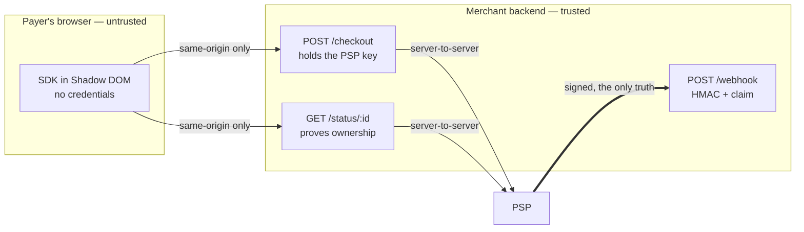
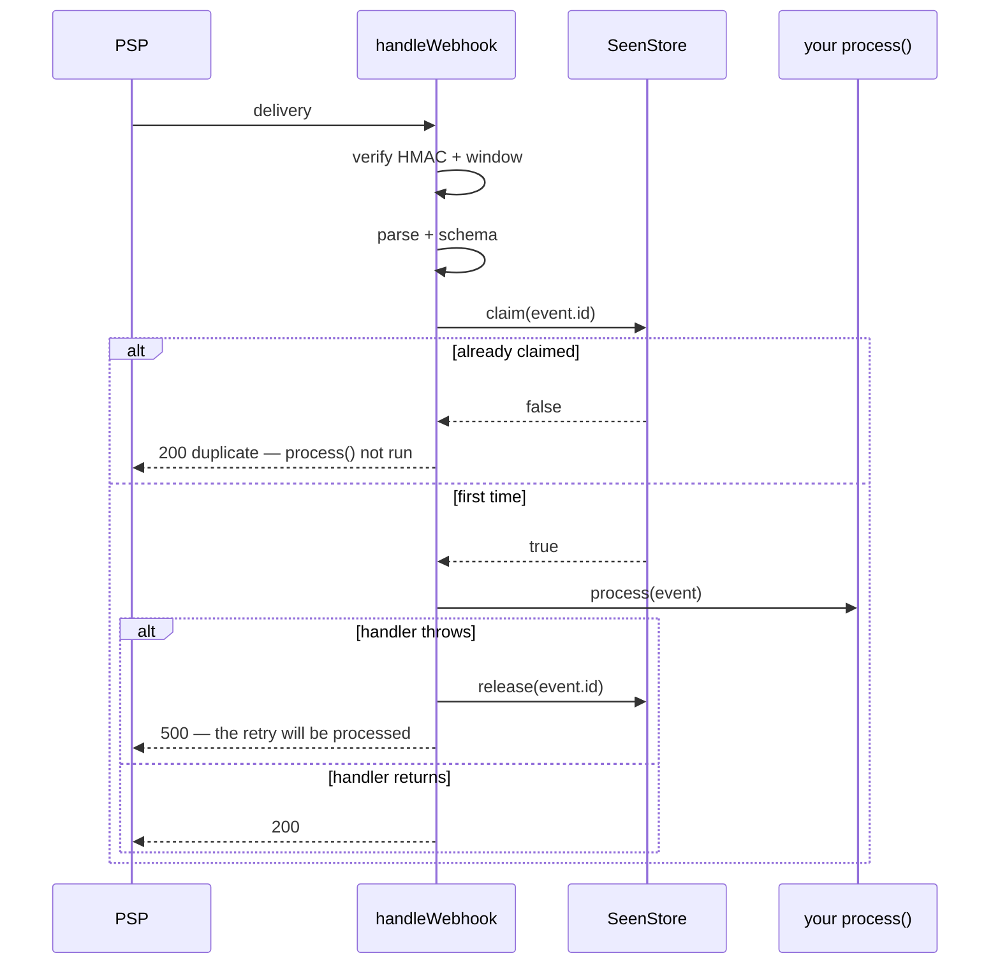

# Security model

The SDK is a guest script on a page where money moves. Its threat model starts from that: assume
the page around it is hostile, the network is hostile, the device clock is wrong, and the payer is
looking at a code they are about to trust.

## The one sentence

**The browser is never the source of truth.** Everything below follows from it.

## Trust boundaries

The SDK crosses exactly one boundary, and it crosses it to the merchant's own origin.

## What the browser never has

| Never in the bundle | Why it stays out |
| --- | --- |
| PSP API keys | The SDK takes `createSession`/`getStatus` **functions**. There is no field to put a key in |
| A webhook secret | Verification is a Node concern, in a separate package |
| A payment confirmation | There is no `onSuccess`. `onPaymentIndicated` is named to be un-mistakable |
| A telemetry endpoint | Zero third-party requests, by policy. A guest script that phones home is disqualifying |

The type system enforces the first one: `CheckoutOptions` has no credential field to fill.

## Payment truth: the webhook

`paid` in the SDK means *the merchant's server reported a payment*. The truth is the signed
webhook, verified in `@nanquim/server`:

- **HMAC-SHA256, compared with `timingSafeEqual`.** Byte lengths are compared first, so the
  comparison cannot throw on a malformed signature — and a malformed signature is `malformed`, a
  distinct outcome from a wrong one.
- **A replay window that is on by default.** A delivery without a timestamp is rejected unless the
  integrator passes `requireTimestamp: false`. The default tolerance is 300 seconds, both
  directions.
- **The signature covers `${timestamp}.${rawBody}`**, so a captured body cannot be replayed under
  a fresh timestamp.
- **Verification runs before `JSON.parse`.** An unauthenticated sender never reaches the parser.

## Exactly-once crediting

The claim is kept **only on success**. A handler that throws releases it, so the PSP's retry is
processed rather than swallowed as a duplicate — the failure mode that silently loses money.

The store must be durable and shared across instances. The in-memory one cannot make anything
idempotent beyond a single process; the reference integration refuses to start with it in
production.

## Idempotency of the charge

The key is generated **in the browser**, by the SDK:

1. `crypto.randomUUID()`.
2. Failing that, `crypto.getRandomValues()` assembled into a v4 UUID by hand.
3. Failing that, `unsupported_environment` — the SDK refuses to run rather than use
   `Math.random()`. A guessable idempotency key is worse than none.

A fresh key per attempt, **reused on a retry after `failed`** — precisely the case where the
charge may already exist behind a network error.

The SDK cannot deduplicate anything. The guarantee is split: the SDK guarantees the key's
*quality*, the integrator's backend guarantees its *effect*, by forwarding it to the PSP or keying
its own charge table on it.

## The amount is an invariant

Pass `charge` and a created charge for a different amount or currency fails with
`amount_mismatch` before anything is drawn. Without it, a compromised or buggy create route can
show a payer a price nobody agreed to, and the payer has no way to tell.

## Session ownership

A session id is a bearer of payment state. The reference status route issues an HMAC-signed grant
cookie (`HttpOnly`, `SameSite=Lax`, `Secure` in production, scoped to `/api/checkout`) when the
session is created, compares it in constant time, and answers **404** when it does not match — a
`403` would confirm the id exists.

PSP responses are parsed through a zod schema and re-serialized before reaching the browser. The
provider payload is never forwarded as-is.

## The clock

Expiry is measured with the local clock over a *duration*, not against an absolute instant. A
device twenty minutes fast would otherwise be shown a fresh code as already expired, and would
stop polling before the confirmation lands.

When the backend gives no `createdAt`, there is no trustworthy duration; the absolute `expiresAt`
stands and `onDegraded({ reason: 'expiry-unanchored' })` fires once. It is reported to the
integrator, not to the screen, because only the integrator can fix it.

## Isolation

Shadow DOM, both directions: the merchant's CSS cannot reach in and break a payment surface, and
the SDK's CSS cannot leak out and break the merchant's page. Customization is a published set of
`--abc-*` custom properties rather than an invitation to write selectors against internals.

Where `attachShadow` does not exist, the SDK renders into a scoped class and reports
`no-shadow-dom` — degraded honestly rather than pretending.

## Network conduct

- Same-origin only. `connect-src 'self'` is a sufficient CSP for the SDK.
- Every outbound call carries an `AbortSignal`; status reads time out at 10 s.
- Polling backs off exponentially with jitter, pauses on a hidden tab and while offline, and stops
  hard at the deadline. A checkout page left open overnight does not hammer anyone's rate limit.
- Zero third-party requests. No fonts, no CDN, no beacons.

## What is deliberately out of scope

**Card payments.** They require a cross-origin iframe and pull PCI scope into the architecture.
That is a different isolation model, and shipping it as a variant of this one would quietly widen
every guarantee on this page. It is version 2, on purpose.

## Reporting a vulnerability

Open a private security advisory on
[the repository](https://github.com/matheusPavaneli/NANQUIM/security/advisories). Please do not
open a public issue for anything touching signature verification, idempotency, or session
ownership.
