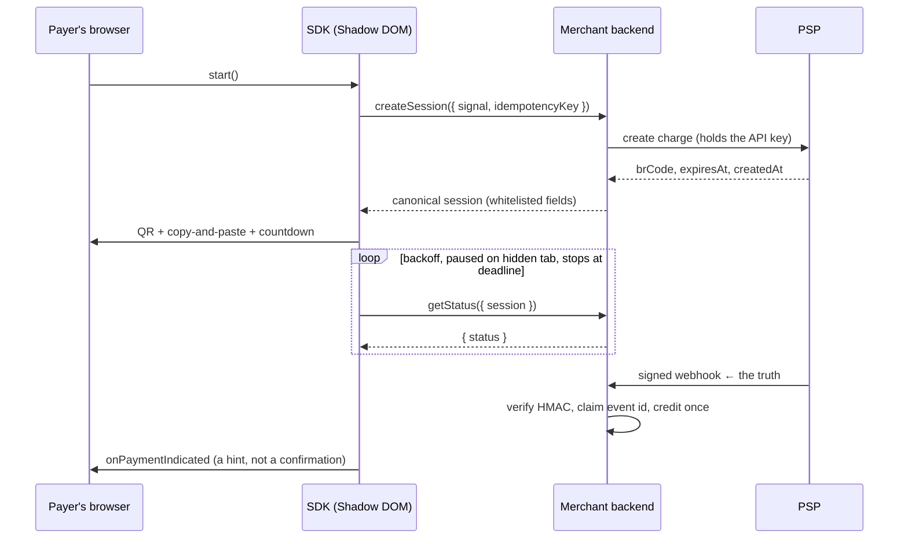

# What this is

A Pix payment surface the merchant **mounts on their own page**. Not a redirect, not a hosted
checkout, not a cross-origin iframe: a component that renders in the merchant's DOM, inside a
Shadow DOM, and talks only to the merchant's own backend.

## The gap it fills

The Brazilian market ships backend SDKs in five to seven languages and stops at the browser. The
fourth exit — the piece the developer would otherwise write by hand — is 800 lines of QR
encoding, copy-and-paste, countdown, polling, retry, error copy, screen-reader announcements and
responsive layout. Every merchant writes it once, badly, and never audits it again.

## What it is responsible for

- Creating the charge **through the merchant's backend** and rendering the result.
- Drawing the QR code (own encoder, byte mode, EC M) and the copy-and-paste payload.
- Counting down to expiry with a clock that a skewed device cannot break.
- Polling for status with backoff, jitter, a pause on hidden tabs and a hard stop at the deadline.
- Saying, in words, what state the payment is in — including "we could not confirm", which is not
  the same as "it failed".
- Accessibility: focus order, live-region announcements at 5 min and 1 min, 200 % zoom, 320 px.

## What it is explicitly not responsible for

- **Confirming a payment.** No `onSuccess` exists. See [Security model](/architecture/security).
- **Holding a credential.** It never sees one. See [The backend contract](/guide/backend).
- **Talking to a PSP.** Providers normalize payloads; they do no networking.
- **Telemetry.** None, at all. A guest script on a payment page that phones home is disqualifying.

## The mental model

Three parties, and the SDK is the smallest one.

Read the [state graph](/statechart) for what the surface does between those arrows, and
[the backend contract](/guide/backend) for what the merchant must implement.
