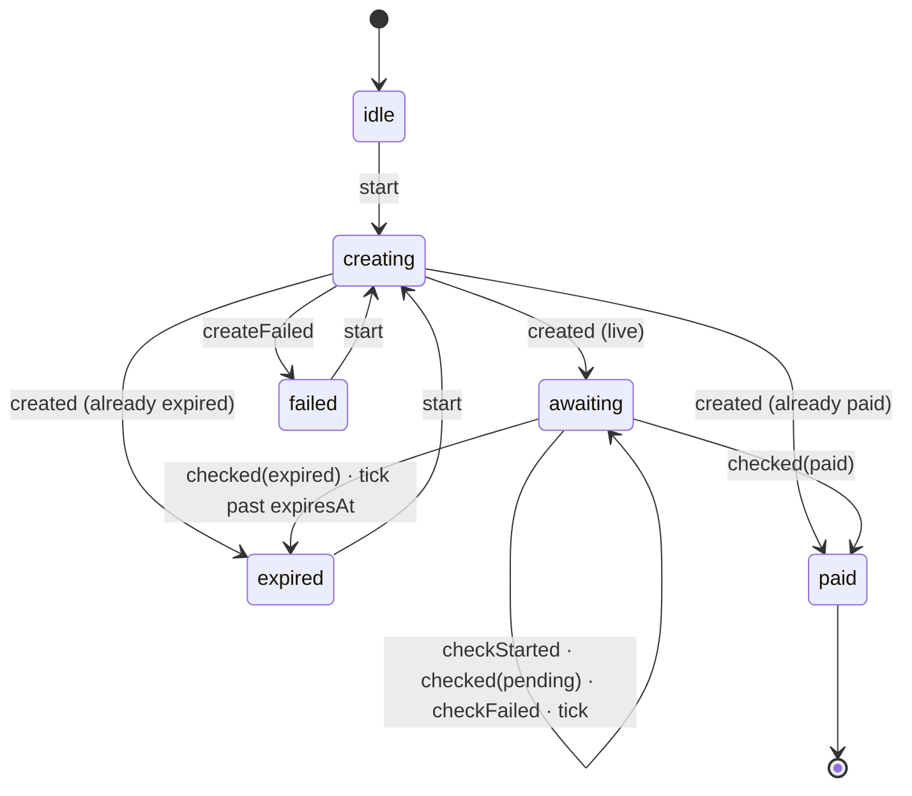

# The state graph

Six states, an almost linear graph with two branches. XState was considered and rejected on
budget; what it would have brought of value here — the documentation — is in this file, and the
behaviour is in `packages/checkout-core/src/state.ts`, a pure function of ~60 lines covered by
`test/state.test.ts`.

## The rules the diagram does not show

- **`checkFailed` never becomes `failed`.** A read that did not answer says nothing about
  whether the payment landed. It increments `failures`, the state stays `awaiting`, and above
  the threshold the surface says it *could not confirm* — never that it failed.
- **`failed` is a failure to create, not to pay.** It is the only state that carries a
  `CheckoutError`, and the copy distinguishes the two explicitly.
- **A Pix that lands after `expiresAt` is `paid`.** The SPI settles in seconds, but the
  confirmation can arrive late; expiry is only asserted when nothing arrived.
- **`start` from `awaiting` or `paid` is a no-op.** A stray call must not throw away a valid
  code nor reopen a charge that was already paid.
- **There is no `disabled`.** A button disabled without a reason is a dead end.

## Where "paid" becomes true

Nowhere in this graph. `paid` here means *the merchant's server reported a payment*, and that is
why the public event is called `onPaymentIndicated` and not `onSuccess`. The truth is the signed
webhook, verified in `@abcheckout/server` with constant-time HMAC and a replay window.
