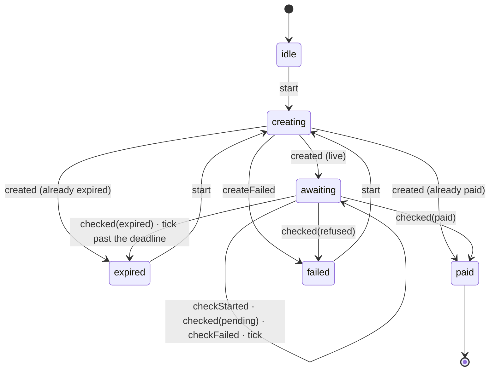

# The state graph

Six states, an almost linear graph with two branches. XState was considered and rejected on
budget; what it would have brought of value here — the documentation — is in this file, and the
behaviour is in `packages/checkout-core/src/state.ts`, a pure function of ~60 lines covered by
`test/state.test.ts`.

## The rules the diagram does not show

- **`checkFailed` never becomes `failed`.** A read that did not answer says nothing about
  whether the payment landed. It increments `failures`, the state stays `awaiting`, and above
  the threshold the surface says it *could not confirm* — never that it failed.
- **`failed` is a failure to create or a charge the PSP took away.** It is the only state that
  carries a `CheckoutError`. A `checked(refused)` report — a cancelled or refunded charge — ends
  the wait there instead of leaving a payable code on screen.
- **A Pix that lands after the deadline is `paid`.** The SPI settles in seconds, but the
  confirmation can arrive late; expiry is only asserted when nothing arrived.
- **The deadline is measured with the local clock.** When the provider says when the charge was
  created, the SDK keeps the *duration* (`Session.expiresInMs`) and counts down from the instant
  the response arrived. A device whose clock is twenty minutes off would otherwise render a fresh
  code as already expired, or stop polling before the confirmation lands. Without a `createdAt`
  there is no trustworthy duration and the absolute `expiresAt` stands — which is reported once
  as `onDegraded({ reason: 'expiry-unanchored' })`, because only the integrator can fix it and
  the payer has no action to take.
- **The amount is an invariant, not a suggestion.** If the created charge disagrees with the
  `charge` the page promised, the SDK fails with `amount_mismatch` instead of quietly drawing a
  different price.
- **`start` from `awaiting` or `paid` is a no-op.** A stray call must not throw away a valid
  code nor reopen a charge that was already paid.
- **There is no `disabled`.** A button disabled without a reason is a dead end.

## Where "paid" becomes true

Nowhere in this graph. `paid` here means *the merchant's server reported a payment*, and that is
why the public event is called `onPaymentIndicated` and not `onSuccess`. The truth is the signed
webhook, verified in `@nanquim/server` with constant-time HMAC and a replay window that is on
by default: `verifyWebhook` refuses a delivery with no timestamp unless the caller passes
`requireTimestamp: false` for a provider that does not send one.

Idempotency is settled in the same place. `handleWebhook` claims the event id atomically through
`SeenStore.claim`, runs the caller's `process` callback, and only keeps the claim if that callback
returned. A handler that throws releases the claim and answers `500`, so the provider's retry is
processed instead of being swallowed as a duplicate.
